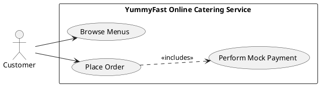
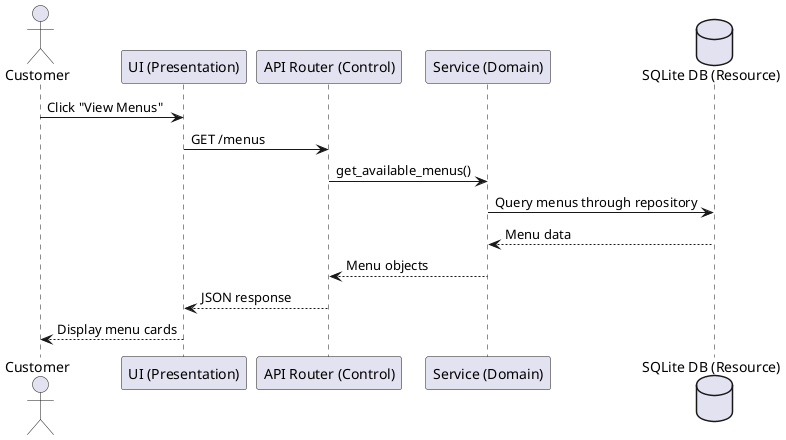

# Software Architecture Document - Phase 1

## 1. System Selection

**Target System:** YummyFast - Online Catering Service

**Platform and Language:** Python with FastAPI for the backend, SQLite for the database, and HTML/CSS/Vanilla JavaScript with Bootstrap for the frontend.

**Architectural Style:** Layered Architecture using a REST API.

**Purpose:** YummyFast provides a streamlined online catering platform where customers can browse available catering menus and place orders through a simple web interface. The Phase 1 implementation focuses on the core ordering workflow, a partial user interface, and a partial backend that demonstrates the selected architecture.

**Users:**

- **Customers:** Browse menus and place catering orders.
- **System Admins:** Manage catering menus in later phases.

**Core Functionalities:**

- Browse available catering menus.
- Select a menu item for ordering.
- Submit customer name, delivery address, and selected menu ID.
- Perform a mock payment by creating an order with a paid status.
- Store menus and orders in a SQLite database.

## 2. Use Case View

The main Phase 1 use case is **Ordering Menus**. A customer accesses the YummyFast web application, views the available catering menus, selects a menu by ID, enters delivery information, and submits the order. The application processes a mock payment and stores the order.

### Use Case Diagram



## 3. Logical View

The system is divided into four responsibility-based layers. This separation keeps the user interface, API control logic, business logic, and data access logic independent from each other.

### Presentation Layer

The Presentation Layer is implemented in `static/index.html`. It contains the partial user interface for Phase 1. The page uses Bootstrap for styling and Vanilla JavaScript for API communication. It calls `GET /menus` to display catering menus and `POST /orders` to submit new orders.

### Control Layer

The Control Layer is implemented in `routers.py`. It defines the FastAPI endpoints and handles HTTP request/response behavior. This layer validates incoming requests through Pydantic schemas and delegates business operations to the Domain Layer. It does not directly access the database.

### Domain Layer

The Domain Layer is implemented in `schemas.py` and `services.py`. `schemas.py` defines request and response data contracts. `services.py` contains business rules, such as checking whether a selected menu exists and whether it is available before creating an order.

### Resource Layer

The Resource Layer is implemented in `database.py`, `models.py`, and `repository.py`. `database.py` configures the SQLite database connection. `models.py` defines SQLAlchemy database models for `Menu` and `Order`. `repository.py` contains database access functions for reading menus and saving orders.

### Layer Interaction

The dependency direction is strictly controlled:

```text
Presentation Layer -> Control Layer -> Domain Layer -> Resource Layer
```

The router calls services, services call repository functions, and repository functions interact with SQLAlchemy and SQLite.

## 4. Process View

YummyFast uses a synchronous HTTP request/response process model. The browser sends HTTP requests to the FastAPI backend, the backend processes the request through the layered architecture, and JSON responses are returned to the frontend.

### Browse Menus Workflow

1. The customer opens the root page `/`.
2. The frontend automatically sends `GET /menus`.
3. `routers.py` receives the request and calls `services.get_available_menus()`.
4. `services.py` applies business logic and calls `repository.get_all_menus()`.
5. `repository.py` queries the SQLite database through SQLAlchemy.
6. The menu data is returned as JSON.
7. The frontend renders the menus as Bootstrap cards.

### Place Order Workflow

1. The customer enters name, address, and menu ID.
2. The frontend sends a JSON request to `POST /orders`.
3. `routers.py` receives and validates the request.
4. `services.py` checks whether the selected menu exists and is available.
5. `repository.py` creates the order record in SQLite.
6. The backend returns the created order with a mock `PAID` status.
7. The frontend displays a success message.

### Process Diagram



## 5. Phase 1 Implementation Summary

The Phase 1 implementation provides a working partial backend and partial frontend. The backend exposes `GET /menus` and `POST /orders`, initializes the database, and inserts three dummy menu records on startup. The frontend demonstrates the main customer use case by browsing menus and placing a mock catering order.
